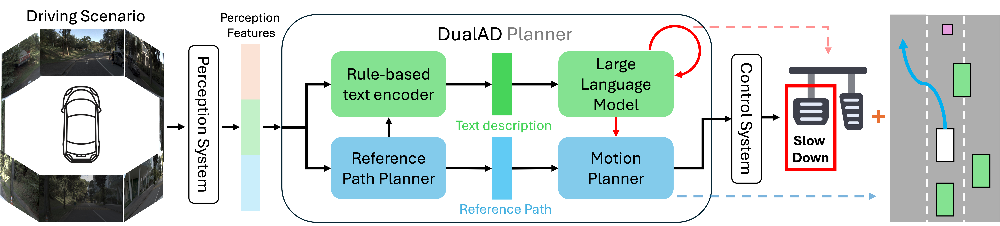

# DualAD: Dual-Layer Planning for Autonomous Driving
 
<div align='center'>



🌍 [Project Page](https://dualad.github.io/) • 🤓 [Paper](https://arxiv.org/pdf/2409.18053) 

</div>

[**TL;DR**] DualAD is an autonomous driving framework that integrates reasoning capabilities (large language models) with traditional planning modules (rule-based) to handle complex driving scenarios. 

## Installation
- Download the nuPlan dataset as described [HERE](https://nuplan-devkit.readthedocs.io/en/latest/dataset_setup.html). The download link is [here](https://www.nuscenes.org/nuplan#download) (You need to sign up first) and you just need to download the ```Mini Split``` in our case. Make sure you have a general filesystem hierarchy like this (nuplan is at the same level as DualAD's working directory) 
   ```bash
   # echo ${HOME} to see what is it
   ${HOME}/nuplan
   ├── exp
   └── dataset
      ├── maps
      └── nuplan-v1.1
   ${HOME}/DualAD
   ```
- Quick install to try DualAD using [miniconda](https://docs.anaconda.com/free/miniconda/miniconda-install/) (This will take some time):
   ```bash
   git clone https://github.com/TUM-AVS/DualAD.git
   cd DualAD
   conda create -n dualad python=3.9
   conda activate dualad
   pip install -e .
   pip install -r requirements_torch.txt
   pip install -r requirements.txt
   # Set env variable
   . set_env.sh
   ```

## Get LLM API (You can skip this to first run the code without LLM)
[GLM-4-Flash](https://bigmodel.cn/usercenter/apikeys) ([FREE](https://open.bigmodel.cn/pricing)) and [GPT-4o](https://platform.openai.com/settings/organization/api-keys) ([Need to pay](https://openai.com/api/pricing/)). For example, the API keys look like below (if you have problem with getting the free one (GLM-4-Flash), feel free to contact dingrui.wang@tum.de)

   ```bash
   # GLM-4-Flash
   7e8138a27b2cd87c7691ac4a7XXXXXXXXXXXXXXXXXXXXXX
   # GPT-4o
   sk-proj-IDX3WOWAk28xifvCyXXXXXXXXXXXXXXXXXXXXXX
   ```
In [```LLM.yml```](./LLM.yml), add your API keys and set ```use_llm``` to ```True```. If you are using GPT-4o, then set ```use_open_ai``` to ```True```.
## Try DualAD
For DualAD (Lattice-IDM):
   ```bash
   python ./nuplan/planning/script/run_simulation.py
   ```

## Performance

DualAD demonstrates improved performance in challenging scenarios compared to other planners. Key metrics such as **Closed-Loop Score (CLS)** and **Reactive Closed-Loop Score (R-CLS)** showcase DualAD’s ability to outperform rule-based and learning-based models in terms of safety and decision quality.

| Planner                  | Hard-55 CLS | Super-Hard-24 CLS |
|--------------------------|-------------|--------------------|
| IDM                      | 50.12       | 34.56             |
| Lattice-IDM              | 52.36       | 39.76             |
| **DualAD (Lattice-IDM)** | **60.25**   | **57.31**         |


## Credits

```text
@article{wang2024dualad,
  title={DualAD: Dual-Layer Planning for Reasoning in Autonomous Driving},
  author={Wang, Dingrui and Kaufeld, Marc and Betz, Johannes},
  journal={arXiv preprint arXiv:2409.18053},
  year={2024}
}
```


## Credits

- [https://github.com/motional/nuplan-devkit](https://github.com/motional/nuplan-devkit)
- [https://github.com/huggingface/huggingface_hub](https://github.com/huggingface/huggingface_hub)
- [https://github.com/autonomousvision/tuplan_garage](https://github.com/autonomousvision/tuplan_garage)
- [https://github.com/jchengai/planTF](https://github.com/jchengai/planTF)